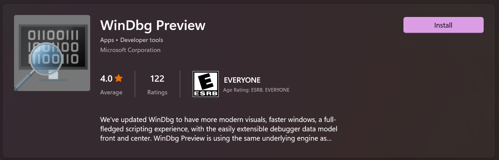
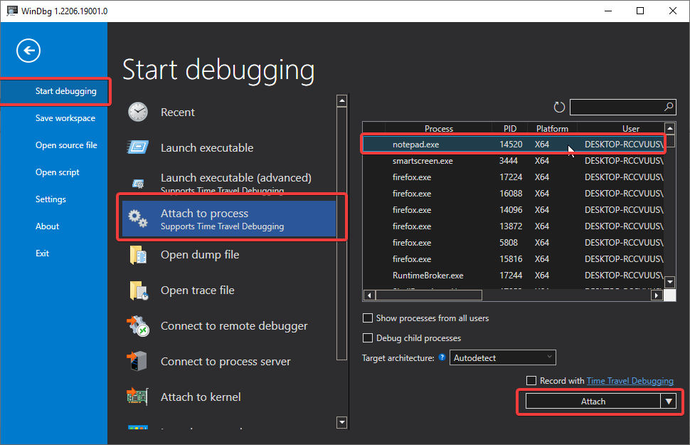
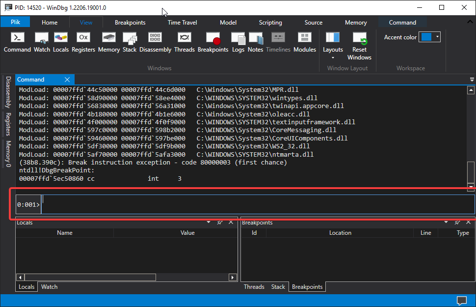

.. image:: ./media/image1.png
   :width: 1.55in
   :height: 0.82119in

**Analiza stuktury peb w systemie windows**

[Process Environment Block]

Spis treści
===========

`Wstęp – Analiza definicja. <#wstęp-analiza-definicja.>`__
`2 <#wstęp-analiza-definicja.>`__

`Czym jest PEB (Process Environment
Block). <#czym-jest-peb-process-environment-block.>`__
`2 <#czym-jest-peb-process-environment-block.>`__

`Potrzebne oprogramowanie. <#potrzebne-oprogramowanie.>`__
`2 <#potrzebne-oprogramowanie.>`__

`Krótkie omówienie na podstawie
dokumentacji <#krótkie-omówienie-na-podstawie-dokumentacji>`__
`4 <#krótkie-omówienie-na-podstawie-dokumentacji>`__

`Ciekawe pola struktury PEB <#ciekawe-pola-struktury-peb>`__
`5 <#ciekawe-pola-struktury-peb>`__

`Kluczowe zastosowanie <#kluczowe-zastosowanie>`__
`5 <#kluczowe-zastosowanie>`__

`Debugowanie <#debugowanie>`__ `5 <#debugowanie>`__

`Analiza złośliwego
oprogramowania <#analiza-złośliwego-oprogramowania>`__
`5 <#analiza-złośliwego-oprogramowania>`__

`Monitorowanie procesów <#monitorowanie-procesów>`__
`5 <#monitorowanie-procesów>`__

`Jak faktycznie znaleźć blok środowiska procesu
(PEB) <#jak-faktycznie-znaleźć-blok-środowiska-procesu-peb>`__
`5 <#jak-faktycznie-znaleźć-blok-środowiska-procesu-peb>`__

`Dostęp do TEB w sposób zgodny z metodami
Windows <#dostęp-do-teb-w-sposób-zgodny-z-metodami-windows>`__
`7 <#dostęp-do-teb-w-sposób-zgodny-z-metodami-windows>`__

`Zakończenie <#zakończenie>`__ `7 <#zakończenie>`__

`Bibliografia <#_Toc182923189>`__ `8 <#_Toc182923189>`__

Wstęp – Analiza definicja.
==========================

Czym jest PEB (Process Environment Block).
------------------------------------------

**PEB (Process Environment Block)** jest struktura tworzona dla każdego
procesu w systemie Windows. Jest ściśle powiązana z **Thread Environment
Block (TEB)**, który zawiera informacje o wątkach procesu. Wątki te, w
czasie wykonywania, odwołują się do **PEB**, aby uzyskać dane dotyczące
swojego procesu. Pozyskać z niego możemy przykładowe informacje.

-  Ścieżka do pliku, który jest wykonywany,

-  Flagę, która mówi czy proces jest aktualnie podłączony pod debugger.

-  Dużo szczegółowych informacji na temat procesu takich jak załadowane
   biblioteki *(Jest to rzecz która autorzy złośliwego oprogramowania
   wykorzystują).*

Między innymi struktura ta odgrywa kluczowa role, ponieważ jest
integralna częścią systemu zarządzania procesami, a zrozumienie jej
pomaga odkryć mechanizmy wykorzystywane przez złośliwe oprogramowanie.
Bardziej rozbudowana definicje dla ciekawych zostawiam tutaj.

*Process Environment Block (PEB) to reprezentacja procesu w trybie
użytkownika. Jest ona najwyższym poziomem wiedzy o procesie w trybie
jądra i najniższym w trybie użytkownika. PEB jest tworzony przez jądro,
ale głównie działa w trybie użytkownika. Jeśli (systemowy) proces nie ma
śladu w trybie użytkownika, nie posiada PEB. Jeśli cokolwiek dotyczącego
procesu jest współdzielone z trybem jądra, ale może być prawidłowo
zarządzane w trybie użytkownika bez konieczności przechodzenia do trybu
jądra, trafia do PEB. Wszystko, co mogłoby być użyteczne do
współdzielenia między modułami w trybie użytkownika, jest przynajmniej
kandydatem do umieszczenia w PEB dla łatwego dostępu. Bardziej
teoretycznie niż praktycznie, dane mogą zostać zapisane w PEB dla
łatwiejszego współdzielenia między procesami niż przez formalną
komunikację międzyprocesową*

(tłum. własne).

(Chappell, 2023)

Potrzebne oprogramowanie.
=========================

Istnieją różne debugery chodź tym polecam korzystać z
`windbg <https://learn.microsoft.com/en-us/windows-hardware/drivers/debugger/>`__
który posiada dużą zaletę możliwość debugowania jaką jest debugowanie z
poziomu kernela. Istnieją również inne debugery warte uwagi takie jak
`x64dbg <https://x64dbg.com/>`__ dostępny na platformie
`github <https://github.com>`__, którym można osiągnąć podobne rzeczy
chodź wymaga to używania wielu obejść i sztuczek.

Rysunek – Zrzut ekranu mojego autorstwa pochodzący z mojego bloga.
(Lewandowski, 2022)

Rysunek – Zrzut ekranu mojego autorstwa pochodzący z mojego bloga.
(Lewandowski, 2022)

Rysunek Zrzut ekranu mojego autorstwa pochodzący z mojego bloga.
(Lewandowski, 2022)

Powinniśmy skończyć z widokiem terminala, w którym będziemy wpisywać
dalsze polecenia.

Krótkie omówienie na podstawie dokumentacji
===========================================

**Struktura Procesu Environment Block (PEB)** to kompleksowa
reprezentacja danych procesu w trybie użytkownika, której głównym celem
jest dostarczanie informacji systemowych procesowi oraz zapewnianie
mechanizmów współdzielenia danych między różnymi komponentami w trybie
użytkownika. Dokumentacja Microsoftu prezentuje następującą definicję
struktury:

typedef struct \_PEB {

BYTE Reserved1[2];

BYTE BeingDebugged;

BYTE Reserved2[1];

PVOID Reserved3[2];

PPEB_LDR_DATA Ler;

PRTL_USER_PROCESS_PARAMETERS ProcessParameters;

PVOID Reserved4[3];

PVOID AtlThunkSListPtr;

PVOID Reserved5;

ULONG Reserved6;

PVOID Reserved7;

ULONG Reserved8;

ULONG AtlThunkSListPtr32;

PVOID Reserved9[45];

BYTE Reserved10[96];

PPS_POST_PROCESS_INIT_ROUTINE PostProcessInitRoutine;

BYTE Reserved11[128];

PVOID Reserved12[1];

ULONG SessionId;

} PEB, \*PPEB;

(Microsoft, 2022)

Ciekawe pola struktury PEB
--------------------------

1. BeingDebugged
^^^^^^^^^^^^^^^^

-  Jest to jednobajtowe pole, które informuje, czy proces jest
   debugowany (wartość 1 oznacza, że proces jest debugowany).

2. Ldr
^^^^^^

-  Wskaźnik do struktury *PEB_LDR_DATA*, która zawiera listę wszystkich
   załadowanych modułów (DLL).

-  Struktura ta umożliwia ustalenie kolejności ładowania bibliotek, co
   bywa używane w analizie złośliwego oprogramowania w celu
   identyfikacji nietypowych lub podejrzanych modułów.

3. ProcessParameters
^^^^^^^^^^^^^^^^^^^^

-  Wskaźnik do struktury *RTL_USER_PROCESS_PARAMETERS*.

-  Zawiera dane takie jak:

   -  Argumenty wiersza poleceń.

   -  Zmienne środowiskowe.

   -  Ścieżkę do katalogu roboczego.

   -  Pełną ścieżkę do pliku wykonywalnego.

Kluczowe zastosowanie
---------------------

Debugowanie
^^^^^^^^^^^

Struktura PEB jest wykorzystywana przez debugery do uzyskiwania
kluczowych informacji o procesach, takich jak:

-  Wskaźniki do list załadowanych modułów.

-  Parametry procesu.

Analiza złośliwego oprogramowania
^^^^^^^^^^^^^^^^^^^^^^^^^^^^^^^^^

W kontekście analizy malware dane w PEB są wykorzystywane do:

-  Wykrywania obecności debuggerów przez złośliwe oprogramowanie.

-  Modyfikowania list załadowanych bibliotek w celu ukrycia swoich
   działań.

Monitorowanie procesów
^^^^^^^^^^^^^^^^^^^^^^

Narzędzia, takie jak Process Explorer, korzystają z danych w PEB do
prezentowania informacji o aktywnych procesach.

Jak faktycznie znaleźć blok środowiska procesu (PEB)
====================================================

W 32-bitowych systemach Windows w trybie użytkownika rejestr **FS**
wskazuje na strukturę zwaną **Thread Environment Block (TEB)** lub
**Thread Information Block (TIB)**. Ta struktura przechowuje informacje
o aktualnie działającym wątku. Jest to szczególnie przydatne, ponieważ
umożliwia pozyskiwanie informacji bez konieczności wywoływania funkcji
API. Warto zauważyć, że rejestr **FS** wskazuje na początkowy adres
struktury TEB, dzięki czemu można uzyskać dostęp do żądanych pól,
dodając odpowiednie przesunięcie. W środowisku x64 zamiast rejestru
**FS** używany jest rejestr **GS**.

**Struktura TEB dla x86/x64**

W przypadku procesów x86 blok PEB znajduje się pod adresem *fs:[0x30]* w
strukturze TEB/TIB, natomiast w procesach x64 jest dostępny pod adresem
*gs:[0x60].*

**Kod ASM dla x64**

*GetPEB proc*

   *mov rax, qword ptr gs:[00000060h] ; przenosi PEB z TEB do rax
   (64-bitowy proces, gs:[0x60])*

   *ret ;zwraca wartość rax*

*GetPEB endp*

**Kod ASM dla x86**

*\__declspec(naked) PEB\* \__stdcall get_peb()*

*{*

*\__asm mov eax, dword ptr fs : [0x30] ; przenosi PEB z TEB do eax
(32-bitowy proces, fs:[0x30])*

*\__asm ret; ; zwraca wartość eax*

*}*

**Alternatywne podejście bez użycia ASM**

Nie ma potrzeby korzystania z assemblera, ponieważ można użyć funkcji
wbudowanych w kompilator, takich jak *\__readfsdword* i
*\__readgsqword*. Funkcje te generują bardziej zoptymalizowany kod.
Warto dodać, że w kompilatorach Microsoftu obsługa wstawianego kodu
assemblerowego dla 64-bitowych celów nie jest wspierana.

*PEB \*GetPeb()*

*{*

*#ifdef \_M_X64*

*return reinterpret_cast<PEB\*>(\__readgsqword(0x60));*

*#elif \_M_IX86*

*return reinterpret_cast<PEB\*>(\__readfsdword(0x30));*

*#else*

*#error "PEB Architecture Unsupported"*

*#endif*

*}*

Dostęp do TEB w sposób zgodny z metodami Windows
------------------------------------------------

Kod działający w trybie użytkownika może łatwo znaleźć **PEB** swojego
procesu, choć wymaga to korzystania z zachowań nieudokumentowanych lub
częściowo udokumentowanych. Gdy wątek wykonuje się w trybie użytkownika,
jego rejestr **fs** (dla kodu 32-bitowego) lub **gs** (dla kodu
64-bitowego) wskazuje na strukturę **TEB** tego wątku. W tej strukturze
pole **ProcessEnvironmentBlock** przechowuje adres **PEB** bieżącego
procesu. Od wersji 5.1 biblioteki **NTDLL** ta operacja jest dostępna w
prostszej formie jako eksportowana funkcja o nazwie
**RtlGetCurrentPeb**, choć sama funkcja również jest nieudokumentowana.
Jej implementacja wygląda mniej więcej tak.

PEB \*RtlGetCurrentPeb(VOID)

{

return NtCurrentTeb()->ProcessEnvironmentBlock;

}

*// For its own low-level user-mode programming, Microsoft has long had
a macro or inlined*

*// routine, apparently named NtCurrentPeb, which reads directly from fs
or gs, e.g.*

PEB \*NtCurrentPeb (VOID)

{

return (PEB \*) \__readfsdword (FIELD_OFFSET (TEB,
ProcessEnvironmentBlock));

}

*Aby użyć funkcji NtCurrentTeb() bez nagłówków Windows, należy
zadeklarować jej prototyp i połączyć program z biblioteką ntdll.dll
podczas linkowania.*

*Fragmenty kodu i informacje pochodzą z mojego bloga.* (Lewandowski,
2022)

Zakończenie
===========

Struktura **PEB** jest integralnym elementem zarządzania procesami w
systemie Windows. Jej dokładna analiza pozwala na zrozumienie sposobu
funkcjonowania procesów oraz mechanizmów systemowych, a także umożliwia
wykrywanie i przeciwdziałanie zagrożeniom bezpieczeństwa. Dzięki
dostępowi do takich danych specjaliści mogą lepiej projektować
zabezpieczenia oraz optymalizować działanie aplikacji.

Bibliografia
============

Chappell, G. (2023, Maj 12). *Geoff Chappell, Software Analyst*. Pobrano
z lokalizacji https://www.geoffchappell.com/index.htm

Lewandowski, K. (2022). Pobrano z lokalizacji
https://void-stack.github.io/

Microsoft. (2022, 1 9). Pobrano z lokalizacji
https://learn.microsoft.com/en-us/windows/win32/api/winternl/ns-winternl-peb
